# SQL Agent LLMOps

<div align="center">


**A modular, multi-model SQL Agent fine-tuned on open-source LLMs and deployed on HuggingFace Spaces**

[Quick Start](#quick-start) • [Architecture](#architecture) • [Models](#models-on-hugging-face-hub) • [Datasets](DATASETS.md) • [Training](#training) • [Contributing](CONTRIBUTING.md)

</div>

---

## Models on Hugging Face Hub

| Model | Base | Status | Link |
|---|---|---|---|
| **SQL Generator** | Qwen2.5-Coder-7B-Instruct | Trained (loss 0.27) | [`DanielRegaladoCardoso/sql-generator-qwen25-coder-7b-lora`](https://huggingface.co/DanielRegaladoCardoso/sql-generator-qwen25-coder-7b-lora) |
| **Chart Reasoner** | Phi-3-Mini-4k-Instruct | Trained | [`DanielRegaladoCardoso/chart-reasoner-phi3-mini-lora`](https://huggingface.co/DanielRegaladoCardoso/chart-reasoner-phi3-mini-lora) · [adapter-only](https://huggingface.co/DanielRegaladoCardoso/chart-reasoner-phi3-mini-adapter-only) |
| **SVG Renderer** | DeepSeek-Coder-1.3B-Instruct | Trained | [`DanielRegaladoCardoso/svg-renderer-deepseek-coder-1.3b-lora`](https://huggingface.co/DanielRegaladoCardoso/svg-renderer-deepseek-coder-1.3b-lora) |

## Datasets on Hugging Face Hub

| Dataset | Rows | Purpose | Link |
|---|---|---|---|
| **text-to-sql-mix-v2** | 761,155 | NL to SQL training (10 sources merged) | [`DanielRegaladoCardoso/text-to-sql-mix-v2`](https://huggingface.co/datasets/DanielRegaladoCardoso/text-to-sql-mix-v2) |
| **chart-reasoning-mix-v1** | ~75,000 | Chart spec reasoning (nvBench + GPT distillation) | [`DanielRegaladoCardoso/chart-reasoning-mix-v1`](https://huggingface.co/datasets/DanielRegaladoCardoso/chart-reasoning-mix-v1) |
| **svg-chart-render-v1** | ~25,000 | Chart spec to inline SVG | [`DanielRegaladoCardoso/svg-chart-render-v1`](https://huggingface.co/datasets/DanielRegaladoCardoso/svg-chart-render-v1) |

Full dataset documentation: [`DATASETS.md`](DATASETS.md)

---

## Overview

SQL Agent LLMOps orchestrates three specialized fine-tuned language models to convert natural-language questions into SQL queries, execute them against user-uploaded data, and render insight-driven visualizations. Each model is small enough to run on consumer GPUs and is independently swappable.

**Key design choices:**
- **Multi-model orchestration** — one specialist per task, not one giant monolith
- **In-memory only** — user data lives in RAM (DuckDB + ChromaDB), never persisted
- **QLoRA fine-tunes** — 4-bit base + small adapters, deployable on free HF Spaces ZeroGPU
- **Reproducible training** — every dataset and training script is open-sourced and re-runnable

---

## Architecture

```mermaid
flowchart LR
    U1["CSV / JSON"]
    U2["NL question"]

    SX["Schema Extractor"]
    RAG["Schema RAG<br/>(ChromaDB)"]
    DB[("DuckDB<br/>in-memory")]

    ORCH{{"Orchestrator"}}

    M1["SQL Generator<br/>Qwen 2.5 Coder 7B<br/>text-to-sql-mix-v2"]
    M2["Chart Reasoner<br/>Phi-3 Mini 3.8B<br/>chart-reasoning-mix-v1"]
    M3["SVG Renderer<br/>DeepSeek Coder 1.3B<br/>svg-chart-render-v1"]

    OUT["Final Chart<br/>inline SVG"]
    FB["Plotly fallback"]

    U1 --> SX
    SX --> RAG
    SX --> DB
    U2 --> ORCH
    RAG --> ORCH
    ORCH --> M1
    M1 -->|SQL| DB
    DB -->|result set| M2
    M2 -->|chart spec| M3
    M3 --> OUT
    M3 -.->|on failure| FB
    FB --> OUT

    classDef input fill:#E3F2FD,stroke:#1976D2,color:#0D47A1
    classDef ingest fill:#FCE4EC,stroke:#C2185B,color:#880E4F
    classDef orch fill:#FFF3E0,stroke:#E65100,color:#BF360C
    classDef model fill:#E8F5E9,stroke:#2E7D32,color:#1B5E20
    classDef output fill:#C8E6C9,stroke:#2E7D32,color:#1B5E20
    classDef fallback fill:#FFF9C4,stroke:#F57F17,color:#E65100

    class U1,U2 input
    class SX,RAG,DB ingest
    class ORCH orch
    class M1,M2,M3 model
    class OUT output
    class FB fallback
```



**Flow**: user uploads data and asks a question, the Orchestrator routes it to the SQL Generator which emits SQL, DuckDB executes the query, the Chart Reasoner designs a chart spec from the result set, and the SVG Renderer emits inline SVG. If SVG generation fails, Plotly renders the chart programmatically from the spec.

---

## Quick Start

### Prerequisites

```bash
python >= 3.10
```

### Install

```bash
git clone https://github.com/DanielRegaladoUMiami/sql-agent-llmops.git
cd sql-agent-llmops
pip install -e .
```

### Run locally

```bash
# Gradio UI
python app/app.py

# Or via Docker
docker compose up
```

For step-by-step setup, training reproduction, and deployment, see [`QUICKSTART.md`](QUICKSTART.md).

---

## Project structure

```
sql-agent-llmops/
├── README.md                  # This file
├── DATASETS.md                # Dataset index
├── QUICKSTART.md              # Setup + reproduction guide
├── CONTRIBUTING.md            # Contribution guide
├── LICENSE                    # Apache 2.0
├── pyproject.toml             # Package config
├── requirements.txt           # Runtime dependencies
├── Dockerfile + docker-compose.yml
│
├── src/
│   ├── orchestrator/          # Multi-model orchestration
│   ├── models/                # SQL Gen / Chart Reasoner / SVG Renderer wrappers
│   ├── rag/                   # ChromaDB schema RAG
│   ├── data_processing/       # CSV/JSON ingestion + schema extraction
│   ├── visualization/         # Plotly fallback renderer
│   └── utils/
│
├── app/
│   ├── app.py                 # Gradio UI (HF Spaces entry point)
│   └── requirements.txt
│
├── configs/
│   ├── model_config.yaml
│   ├── training_config.yaml
│   └── deployment_config.yaml
│
├── training/
│   ├── data_pipelines/        # UV scripts that build the 3 datasets
│   ├── jobs/                  # HF Jobs training scripts (production)
│   ├── notebooks/             # Colab notebooks (exploratory)
│   ├── sql_generator/
│   ├── chart_reasoner/
│   └── svg_renderer/
│
└── tests/
    ├── test_orchestrator.py
    ├── test_plotly_fallback.py
    ├── test_schema_extractor.py
    └── test_sql_executor.py
```

---

## Training

All three models are fine-tuned with **[Unsloth](https://github.com/unslothai/unsloth)** (4-bit QLoRA) + TRL `SFTTrainer`. Production training runs on [Hugging Face Jobs](https://huggingface.co/docs/hub/jobs); exploratory work happens in `training/notebooks/`.

### 1. SQL Generator — Qwen2.5-Coder-7B (trained)

| Setting | Value |
|---|---|
| Dataset | [`text-to-sql-mix-v2`](https://huggingface.co/datasets/DanielRegaladoCardoso/text-to-sql-mix-v2) — 761,155 rows |
| Examples used (after seq-len filter ≤ 1024) | **672,949** (93.1%) |
| Sequences after packing | 154,462 |
| LoRA | r=16, α=32, on `q/k/v/o/gate/up/down_proj` |
| Hardware | 1× NVIDIA L40S (48 GB) on HF Jobs |
| Throughput | 4.93 s/step (effective batch 16, seq 1024) |
| Total steps | 9,654 (1 epoch) |
| Wall-clock time | **13.5 hours** |
| Final training loss | **0.2658** |
| Cost | ~$24 |
| Output | [`sql-generator-qwen25-coder-7b-lora`](https://huggingface.co/DanielRegaladoCardoso/sql-generator-qwen25-coder-7b-lora) |

Training script: [`training/jobs/train_sql_generator_job.py`](training/jobs/train_sql_generator_job.py)
Launch instructions: [`training/jobs/README.md`](training/jobs/README.md)

### 2. Chart Reasoner — Phi-3-Mini-3.8B (trained)

- **Dataset**: [`chart-reasoning-mix-v1`](https://huggingface.co/datasets/DanielRegaladoCardoso/chart-reasoning-mix-v1) — ~75 k rows from **nvBench** (25 k real NL/chart pairs) plus **GPT-4.1-nano knowledge distillation** over `text-to-sql-mix-v2` (50 k pairs generated with a Tufte/Knaflic/Few storytelling system prompt)
- **Output**: structured JSON spec (`chart_type, encoding, title, sort, color_strategy, annotations, rationale`)
- **Build script**: [`training/data_pipelines/build_chart_mix.py`](training/data_pipelines/build_chart_mix.py)
- **Models on Hub**:
  - [`chart-reasoner-phi3-mini-lora`](https://huggingface.co/DanielRegaladoCardoso/chart-reasoner-phi3-mini-lora) — merged 16-bit + adapter
  - [`chart-reasoner-phi3-mini-adapter-only`](https://huggingface.co/DanielRegaladoCardoso/chart-reasoner-phi3-mini-adapter-only) — LoRA adapter only (lighter download)

### 3. SVG Renderer — DeepSeek-Coder-1.3B (trained)

- **Dataset**: [`svg-chart-render-v1`](https://huggingface.co/datasets/DanielRegaladoCardoso/svg-chart-render-v1) — ~25 k `(chart_spec → SVG)` pairs from nvBench configs re-rendered via matplotlib's SVG backend, plus chart-shaped SVGs filtered from `umuthopeyildirim/svgen-500k`
- **Output**: inline SVG string
- **Build script**: [`training/data_pipelines/build_svg_mix.py`](training/data_pipelines/build_svg_mix.py)
- **Model on Hub**: [`svg-renderer-deepseek-coder-1.3b-lora`](https://huggingface.co/DanielRegaladoCardoso/svg-renderer-deepseek-coder-1.3b-lora)

### Cost summary

| Stage | Compute | Cost |
|---|---|---|
| SQL Generator training | HF Jobs L40S, 13.5h | ~$24 |
| Chart Reasoner training | Colab / HF Jobs | ~$3 |
| SVG Renderer training | Colab / HF Jobs | ~$1 |
| Chart dataset OpenAI synthesis | gpt-4.1-nano Batch API, 50 k | ~$2.50 |
| Inference hosting | HF Spaces ZeroGPU (free) | $0 |

---

## Inference

### Use the trained SQL Generator

```python
from transformers import AutoModelForCausalLM, AutoTokenizer

REPO = "DanielRegaladoCardoso/sql-generator-qwen25-coder-7b-lora"

model = AutoModelForCausalLM.from_pretrained(REPO, torch_dtype="auto", device_map="auto")
tokenizer = AutoTokenizer.from_pretrained(REPO)

messages = [
 {"role": "system", "content": "You are a SQL expert. Given a SQL schema and a natural-language question, generate a correct SQL query answering the question. Return only the SQL."},
 {"role": "user", "content": "### Schema\nCREATE TABLE players (id INT, name VARCHAR, hometown VARCHAR);\n\n### Question\nList all players from Tampa, Florida."},
]
input_ids = tokenizer.apply_chat_template(messages, tokenize=True, add_generation_prompt=True, return_tensors="pt").to(model.device)
out = model.generate(input_ids, max_new_tokens=256, do_sample=False)
print(tokenizer.decode(out[0][input_ids.shape[1]:], skip_special_tokens=True))
```

Full usage examples (LoRA-only loading, Unsloth, etc.) on the [model card](https://huggingface.co/DanielRegaladoCardoso/sql-generator-qwen25-coder-7b-lora).

---

## Data and Privacy

- **In-memory only** — uploaded data lives in DuckDB + ChromaDB RAM, never written to disk
- **No telemetry** — no logging, no analytics
- **No retraining on user data** — models are frozen between releases
- **Ephemeral sessions** — everything is wiped when the Space restarts

```python
# Production-safe RAG config
from chromadb.config import Settings
client = chromadb.Client(Settings(
 is_persistent=False,
 anonymized_telemetry=False,
 allow_reset=True,
))
```

---

## Deployment

### HuggingFace Spaces (recommended, free tier)

1. Fork this repo
2. Create a new Space, Gradio template
3. Link the Space to your fork
4. Add ZeroGPU hardware (free)
5. Set secret `HF_TOKEN` (read-only is enough)
6. Auto-deploys on push

### Docker

```bash
docker build -t sql-agent .
docker run -p 7860:7860 -e HF_TOKEN=$HF_TOKEN sql-agent
```

---

## Contributing

Contributions welcome — see [`CONTRIBUTING.md`](CONTRIBUTING.md). Areas where help is most useful:
- Eval harness on Spider / WikiSQL / BIRD test splits
- End-to-end orchestrator wiring (the 3 specialist models exist; the connecting glue and Gradio UI need polish)
- Additional SQL dialects in `text-to-sql-mix-v2` (PostgreSQL, BigQuery)

---

## Citation

```bibtex
@misc{regalado2026sqlagent,
 author = {Daniel Regalado Cardoso},
 title = {SQL Agent LLMOps: Multi-Model Orchestration for Text-to-SQL with Visualization},
 year = {2026},
 howpublished = {\url{https://github.com/DanielRegaladoUMiami/sql-agent-llmops}},
}
```

## License

Apache 2.0 — see [`LICENSE`](LICENSE).

## Acknowledgments

- [Unsloth](https://github.com/unslothai/unsloth) — 2x faster QLoRA training
- [TRL](https://github.com/huggingface/trl) — `SFTTrainer`
- [Hugging Face Jobs](https://huggingface.co/docs/hub/jobs) — training infrastructure
- Qwen, Microsoft, DeepSeek teams — base models
- All authors of the source datasets (see [`DATASETS.md`](DATASETS.md))
