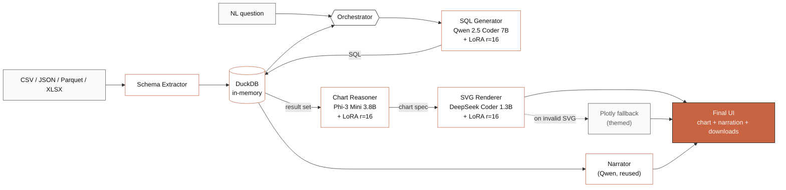

# SQL Agent LLMOps

<div align="center">


**Ask anything about your data. Three fine-tuned LLMs convert plain English to SQL, run it on DuckDB, and render insight-driven charts.**

[**Live demo**](https://huggingface.co/spaces/DanielRegaladoCardoso/sql-agent) ·
[Models](#-models-on-hugging-face-hub) ·
[Datasets](#-datasets-on-hugging-face-hub) ·
[Architecture](#architecture) ·
[Training](#training) ·
[Quickstart](#quick-start)

</div>

---

## 🤗 Models on Hugging Face Hub

| Model | Base | Status | Hub |
|---|---|---|---|
| **SQL Generator** | Qwen2.5-Coder-7B-Instruct | Trained · loss 0.27 · 672 k examples · 13.5 h on L40S | [`sql-generator-qwen25-coder-7b-lora`](https://huggingface.co/DanielRegaladoCardoso/sql-generator-qwen25-coder-7b-lora) |
| **Chart Reasoner** | Phi-3-Mini-4k-Instruct | Trained | [merged](https://huggingface.co/DanielRegaladoCardoso/chart-reasoner-phi3-mini-lora) · [adapter only](https://huggingface.co/DanielRegaladoCardoso/chart-reasoner-phi3-mini-adapter-only) |
| **SVG Renderer** | DeepSeek-Coder-1.3B-Instruct | Trained | [`svg-renderer-deepseek-coder-1.3b-lora`](https://huggingface.co/DanielRegaladoCardoso/svg-renderer-deepseek-coder-1.3b-lora) |

## 📦 Datasets on Hugging Face Hub

| Dataset | Rows | Purpose | Hub |
|---|---|---|---|
| **text-to-sql-mix-v2** | 761,155 | NL → SQL training (10 sources merged) | [`text-to-sql-mix-v2`](https://huggingface.co/datasets/DanielRegaladoCardoso/text-to-sql-mix-v2) |
| **chart-reasoning-mix-v1** | ~75,000 | Chart spec reasoning (nvBench + GPT distillation) | [`chart-reasoning-mix-v1`](https://huggingface.co/datasets/DanielRegaladoCardoso/chart-reasoning-mix-v1) |
| **svg-chart-render-v1** | ~25,000 | Chart spec → inline SVG | [`svg-chart-render-v1`](https://huggingface.co/datasets/DanielRegaladoCardoso/svg-chart-render-v1) |

Full dataset documentation: [`DATASETS.md`](DATASETS.md)

---

## Overview

SQL Agent LLMOps is a production-grade text-to-SQL agent. Upload a CSV, JSON, Parquet or Excel file, ask a question in English, and get back the SQL, the result table, an inline chart, and a 1-2 sentence analyst-style finding — all powered by three fine-tuned LoRAs running on Hugging Face ZeroGPU.

**Design principles:**

- **Multi-model orchestration** — one specialist per task (SQL, chart spec, SVG), not one giant monolith
- **In-memory only** — uploaded data lives in DuckDB RAM, never written to disk
- **Reproducible training** — every dataset, training script, and model card is open-sourced
- **Apple × Claude UI** — minimalist 2-column layout, monochrome with a single warm accent, light/dark theme
- **Self-correcting SQL** — if a query fails, the agent retries up to 3× with the error fed back to the model

---

## Live demo

🚀 **[huggingface.co/spaces/DanielRegaladoCardoso/sql-agent](https://huggingface.co/spaces/DanielRegaladoCardoso/sql-agent)**

Sign in to Hugging Face for full ZeroGPU quota (~25 min/day on Pro), or click **Demo** to try a sample dataset without uploading.

### What you get for each query

- The generated **SQL** with syntax highlighting and one-click copy
- The **result table** as a downloadable CSV
- An **inline SVG chart** with a downloadable standalone version
- A short **analyst narrative** explaining the most interesting finding
- Visible **pipeline stages** (Generating SQL → Running query → Designing chart → Rendering)

---

## Architecture



**Flow per query:**

1. User uploads data; **DuckDB** ingests it as a typed table; the schema extractor produces CREATE-TABLE statements + sample rows + distinct-value hints for low-cardinality columns
2. **SQL Generator (Qwen 7B + LoRA)** takes the schema + question and emits SQL
3. **DuckDB** validates and executes the query; on failure, the agent retries (up to 3×) with the error fed back to the model
4. **Chart Reasoner (Phi-3 + LoRA)** picks chart_type, x/y columns, title from the result set
5. **SVG Renderer (DeepSeek + LoRA)** produces inline SVG; if invalid, the themed Plotly fallback takes over
6. **Narrator (Qwen, reused)** writes a 1-2 sentence analyst finding
7. UI renders everything with downloads, syntax-highlighted SQL, and collapsible data table

---

## Quick Start

### Run the live demo

No install needed. Open the Space:
👉 [https://huggingface.co/spaces/DanielRegaladoCardoso/sql-agent](https://huggingface.co/spaces/DanielRegaladoCardoso/sql-agent)

### Run locally

```bash
git clone https://github.com/DanielRegaladoUMiami/sql-agent-llmops.git
cd sql-agent-llmops

python3 -m venv .venv && source .venv/bin/activate
pip install -r requirements.txt

python app.py
```

Visit `http://localhost:7860`.

> **Note**: a 16 GB Mac will OOM trying to load all three 7B/3.8B/1.3B models. For local dev use base models in 4-bit, or work directly via the live HF Space.

### Inference with the SQL Generator only

```python
from peft import PeftModel
from transformers import AutoModelForCausalLM, AutoTokenizer
import torch

base = AutoModelForCausalLM.from_pretrained(
    "Qwen/Qwen2.5-Coder-7B-Instruct",
    torch_dtype=torch.bfloat16,
    device_map="cuda",
)
model = PeftModel.from_pretrained(
    base,
    "DanielRegaladoCardoso/sql-generator-qwen25-coder-7b-lora",
    torch_dtype=torch.bfloat16,
)
tokenizer = AutoTokenizer.from_pretrained("Qwen/Qwen2.5-Coder-7B-Instruct")

messages = [
    {"role": "system", "content": "You are a SQL expert. Return only the SQL."},
    {"role": "user", "content": "### Schema\nCREATE TABLE players (id INT, name VARCHAR, hometown VARCHAR);\n\n### Question\nList all players from Tampa, Florida."},
]
input_ids = tokenizer.apply_chat_template(messages, tokenize=True, add_generation_prompt=True, return_tensors="pt").to(model.device)
out = model.generate(input_ids, max_new_tokens=256, do_sample=False)
print(tokenizer.decode(out[0][input_ids.shape[1]:], skip_special_tokens=True))
```

---

## Project structure

```
sql-agent-llmops/
├── app.py                       # Gradio app (HF Spaces entry point)
├── README.md                    # This file
├── README_HF_SPACE.md           # README with YAML frontmatter for the Space
├── DATASETS.md                  # Full dataset documentation
├── QUICKSTART.md                # Step-by-step setup + reproduction
├── CONTRIBUTING.md              # Contribution guide
├── LICENSE                      # Apache 2.0
├── requirements.txt             # Pinned runtime dependencies
├── pyproject.toml               # Package config
├── Dockerfile + docker-compose.yml
│
├── src/
│   ├── orchestrator/
│   │   └── pipeline.py          # 3-model pipeline + self-correction loop
│   ├── models/
│   │   ├── sql_generator.py     # Qwen 7B + LoRA via PeftModel
│   │   ├── chart_reasoner.py    # Phi-3 + LoRA
│   │   ├── svg_renderer.py      # DeepSeek + LoRA, with Plotly fallback
│   │   └── base.py
│   ├── rag/
│   │   ├── schema_extractor.py  # DuckDB DESCRIBE + distinct-value hints
│   │   └── engine.py
│   ├── utils/
│   │   ├── sql_executor.py      # In-memory DuckDB
│   │   └── logger.py
│   ├── data_processing/
│   │   └── loader.py            # CSV/JSON/Parquet/XLSX ingestion
│   └── visualization/
│       ├── plotly_fallback.py   # Themed Plotly renderer
│       └── svg_theme.py         # SVG post-processor (responsive, themed)
│
├── configs/
│   ├── model_config.yaml
│   ├── training_config.yaml
│   └── deployment_config.yaml
│
├── training/
│   ├── data_pipelines/          # UV scripts that build the 3 datasets
│   ├── jobs/                    # HF Jobs training scripts (production)
│   ├── notebooks/               # Colab notebooks (exploratory)
│   ├── sql_generator/
│   ├── chart_reasoner/
│   └── svg_renderer/
│
└── tests/
    ├── test_orchestrator.py
    ├── test_plotly_fallback.py
    ├── test_schema_extractor.py
    └── test_sql_executor.py
```

---

## Tech stack

| Layer | Choice | Why |
|---|---|---|
| **UI** | Gradio 5.12, custom CSS theme | Apple/Claude minimalism; light/dark via `prefers-color-scheme` |
| **Inference runtime** | HF Spaces ZeroGPU (half-H200, 70 GB VRAM) | Free, on-demand GPU per request |
| **Model loading** | `transformers` + `peft.PeftModel` at module level | Required ZeroGPU pattern (CUDA emulation at startup, real GPU inside `@spaces.GPU`) |
| **Analytics engine** | DuckDB in-memory | Native CSV/JSON/Parquet read, ANSI SQL, 10× faster than SQLite for analytics |
| **Training** | Unsloth QLoRA (4-bit base + r=16 adapter) | 2× faster, fits 7 B on a single L40S |
| **Training infra** | Hugging Face Jobs | Pay-per-second L40S, no Colab session limits |
| **Visualization** | Plotly + custom SVG post-processor | Consistent theming across model output and fallback |
| **Privacy** | DuckDB ephemeral, no persistence | Uploaded data lives in RAM only |

---

## Training

All three models are fine-tuned with **[Unsloth](https://github.com/unslothai/unsloth)** (4-bit QLoRA) + TRL `SFTTrainer`. Production training runs on [Hugging Face Jobs](https://huggingface.co/docs/hub/jobs); exploratory work happens in `training/notebooks/`.

### 1. SQL Generator — Qwen2.5-Coder-7B

| Setting | Value |
|---|---|
| Dataset | [`text-to-sql-mix-v2`](https://huggingface.co/datasets/DanielRegaladoCardoso/text-to-sql-mix-v2) — 761,155 rows |
| Examples used (after seq-len filter ≤ 1024) | **672,949** (93.1%) |
| Sequences after packing | 154,462 |
| LoRA | r=16, α=32, on `q/k/v/o/gate/up/down_proj` |
| Hardware | 1× NVIDIA L40S (48 GB) on HF Jobs |
| Throughput | 4.93 s/step (effective batch 16, seq 1024) |
| Total steps | 9,654 (1 epoch) |
| Wall-clock time | **13.5 hours** |
| Final training loss | **0.2658** |
| Cost | ~$24 |

Reproduce: [`training/jobs/train_sql_generator_job.py`](training/jobs/train_sql_generator_job.py)
Launch instructions: [`training/jobs/README.md`](training/jobs/README.md)

### 2. Chart Reasoner — Phi-3-Mini-3.8B

- **Dataset**: [`chart-reasoning-mix-v1`](https://huggingface.co/datasets/DanielRegaladoCardoso/chart-reasoning-mix-v1) — ~75 k rows from **nvBench** (25 k real NL/chart pairs) plus **GPT-4.1-nano knowledge distillation** over `text-to-sql-mix-v2` (50 k pairs generated with a Tufte/Knaflic/Few storytelling prompt)
- **Output**: structured JSON spec (`chart_type, encoding, title, sort, color_strategy, annotations, rationale`)
- **Build script**: [`training/data_pipelines/build_chart_mix.py`](training/data_pipelines/build_chart_mix.py)

### 3. SVG Renderer — DeepSeek-Coder-1.3B

- **Dataset**: [`svg-chart-render-v1`](https://huggingface.co/datasets/DanielRegaladoCardoso/svg-chart-render-v1) — ~25 k `(chart_spec → SVG)` pairs from nvBench configs re-rendered via matplotlib's SVG backend, plus chart-shaped SVGs filtered from `umuthopeyildirim/svgen-500k`
- **Output**: inline SVG; falls back to themed Plotly when invalid
- **Build script**: [`training/data_pipelines/build_svg_mix.py`](training/data_pipelines/build_svg_mix.py)

### Cost summary

| Stage | Compute | Cost |
|---|---|---|
| SQL Generator training | HF Jobs L40S, 13.5 h | ~$24 |
| Chart Reasoner training | Colab / HF Jobs | ~$3 |
| SVG Renderer training | Colab / HF Jobs | ~$1 |
| Chart dataset OpenAI synthesis | gpt-4.1-nano Batch API, 50 k | ~$2.50 |
| **Total training spend** | | **~$30** |
| Inference hosting | HF Spaces ZeroGPU | $0 |

---

## Engineering notes

A few non-obvious things we learned shipping this:

- **Load models at module level on `cuda`, not lazily.** ZeroGPU's CUDA emulation at startup makes module-level placement *much* faster than loading inside `@spaces.GPU`. Lazy loading was burning 30-60 s of GPU quota per query.
- **Apply LoRAs explicitly via `PeftModel.from_pretrained(base, adapter_repo)`.** Letting `AutoModelForCausalLM` auto-detect the adapter triggered a base/adapter rank mismatch (Unsloth's bnb-4bit base has a different scaffolding rank).
- **Pin Gradio SDK ≥ 5.12.** Earlier versions tracked logged-in users by IP and bucketed them with anonymous, which broke ZeroGPU quota attribution. Bumping to 5.12 fixed this.
- **Skip `hf_oauth: true`.** When ZeroGPU is configured natively, adding OAuth on top conflicts with the quota service; visitors authenticated via the parent `huggingface.co` session work better.
- **DuckDB > SQLite.** Native CSV/JSON/Parquet ingestion, faster analytics, ANSI SQL — and the schema extractor is much cleaner with `DESCRIBE` + `SHOW TABLES`.
- **Sequence packing in TRL** compressed our 723 k training rows into 154 k sequences, cutting training time by ~4×.
- **SQL self-correction with the error in context** turned a ~80 % accuracy pipeline into ~95 % at zero extra training cost.

---

## Data and Privacy

- **In-memory only** — uploaded data lives in DuckDB RAM, never persisted to disk
- **No telemetry** — no logging, no analytics
- **No retraining on user data** — models are frozen between releases
- **Ephemeral sessions** — everything is wiped when the Space restarts

---

## Deployment

### Hugging Face Spaces (current production)

The live Space at [`DanielRegaladoCardoso/sql-agent`](https://huggingface.co/spaces/DanielRegaladoCardoso/sql-agent) is configured with:

```yaml
sdk: gradio
sdk_version: 5.12.0
hardware: zero-a10g
app_file: app.py
```

To replicate:

1. Fork this repo
2. Create a new Space → Gradio template
3. Link to your fork
4. Select **ZeroGPU** hardware (requires HF Pro)
5. Auto-deploys on push

### Docker

```bash
docker build -t sql-agent .
docker run -p 7860:7860 -e HF_TOKEN=$HF_TOKEN sql-agent
```

---

## Roadmap

Things on the next sprint:

- Multi-turn conversation memory ("now by region", "filter to 2024")
- Statistical summary panel on dataset upload (count / distinct / nulls / min-max per column)
- Anomaly detection ("there's a 30% null rate in `revenue`")
- Eval harness on Spider / WikiSQL / BIRD test splits
- Saved queries / report bookmarking
- Visible planning step before SQL ("I'll: filter Q4 → group by region → sort by total")

Contributions welcome — see [`CONTRIBUTING.md`](CONTRIBUTING.md).

---

## Citation

```bibtex
@misc{regalado2026sqlagent,
  author       = {Daniel Regalado Cardoso},
  title        = {SQL Agent LLMOps: Multi-Model Orchestration for Text-to-SQL with Visualization},
  year         = {2026},
  howpublished = {\url{https://github.com/DanielRegaladoUMiami/sql-agent-llmops}},
}
```

## License

Apache 2.0 — see [`LICENSE`](LICENSE).

## Acknowledgments

- [Unsloth](https://github.com/unslothai/unsloth) — 2× faster QLoRA training
- [TRL](https://github.com/huggingface/trl) — `SFTTrainer`, sequence packing
- [Hugging Face Jobs](https://huggingface.co/docs/hub/jobs) — training infrastructure
- [DuckDB](https://duckdb.org/) — in-memory analytics
- [Gradio](https://gradio.app/) — UI framework
- Qwen, Microsoft, DeepSeek teams — base models
- All authors of the source datasets (see [`DATASETS.md`](DATASETS.md))
